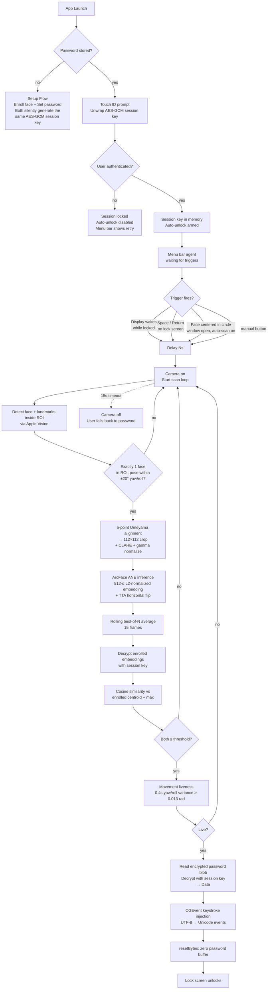

# FaceUnlock

A face-recognition unlock daemon for macOS. When you lock your Mac, FaceUnlock recognizes you through the camera and types your password into the lock screen for you. No additional hardware required — the FaceTime camera and Apple Neural Engine do the work.

**Everything is processed locally.** Nothing leaves your Mac. The full stack — camera capture, face detection, ML inference, encryption — runs on-device.

> ⚠️ Personal-use security tool. Read the **Security model** section before relying on it.

---

## What it does

- Enrolls your face from 7 poses (straight, turn left/right, roll left/right, closer, farther) using **ArcFace** — the InsightFace ResNet50 model (buffalo_l / w600k_r50) converted to Core ML and executed on the Apple Neural Engine.
- Enrollment captures each pose over a **2-second stability window** (multi-frame average → single high-quality embedding). Additive: you can run **"Add Captures"** later under different lighting to enlarge the enrolled set (up to 35 embeddings, oldest evicted FIFO).
- On lock screen, when you press Space / Return or the display wakes from sleep, it silently scans your face, verifies identity + liveness, and types your Mac password into the password field.
- Runs as a menu bar agent. Dock icon is optional and toggled at runtime.
- Both the **Mac password** and the **enrolled face embeddings** are encrypted with AES-GCM using a session key that itself lives in the Keychain protected by Touch ID. First app launch after each reboot requires one Touch ID to unwrap the session key — same model as Face ID and Windows Hello.

## Requirements

- macOS **14 (Sonoma)** or later
- Apple Silicon strongly recommended (ANE inference is fastest there). Intel Macs work but slower.
- A camera the OS considers the default (built-in FaceTime, external webcam if that's the only camera, or Continuity Camera on macOS 13+).
- Touch ID **or** a device password.

## End-to-end flow



## Setup

### One-time

1. Open FaceUnlock.app.
2. **Camera permission** → allow when prompted.
3. **Accessibility permission**: Settings tab → "Request Permission…" → toggle FaceUnlock on in System Settings → Privacy & Security → Accessibility. Required to inject keystrokes into the lock screen.
4. **Set Mac password**: Settings tab → "Set Password…" → enter your macOS login password twice. Generates a fresh AES-GCM 256-bit session key (or reuses the one from a prior enrollment), encrypts the password with it.
5. **Enroll your face**: Face Recognition tab → "Capture" (requires Touch ID). Follow the 7-pose guide — each pose is captured over a **~2-second stability window** where multiple frames are averaged into a single high-quality embedding (√N noise reduction over a single-shot). The resulting embeddings are encrypted with the same session key before being written to disk.
6. Turn on **"Auto-unlock when display wakes (while screen is locked)"** in Settings tab.

### Improving accuracy over time

Once you're enrolled, use **"Add Captures"** (the same button, relabeled once an enrollment exists) whenever you're in noticeably different lighting — morning window light vs afternoon overhead vs evening lamp, or with/without glasses. Each Add Captures session enrolls 7 more stable embeddings alongside the existing ones. This is the model that Face ID and Windows Hello use internally, and it's the reliable way to reach high thresholds (0.85+) across the full range of lighting you encounter daily.

- Sessions 1–5: pure accumulation, growing 7 → 14 → 21 → 28 → 35.
- Session 6+: at cap. Each new session evicts the oldest 7 embeddings (FIFO), so the enrolled set naturally tracks your current appearance / lighting over time.

### Optional

- **Icon Placement** (menu bar → Icon Placement): toggle Dock and/or Menu Bar visibility independently.
- **Launch at Login**: use macOS's built-in **System Settings → General → Login Items → Open at Login** to add FaceUnlock so it starts with your Mac.
- **Auto-scan when face is centered**: polls the camera and triggers automatically when your face is well-positioned in the circle. Off by default.
- **Match threshold**: default 0.70. Personal-use recommendations after enrollment: **0.75** balanced, **0.80** secure daily driver, **0.85** high-security (needs 2-3 Add Captures sessions across different lighting to be reliable). 0.90+ is not realistically achievable with a 2D camera. Persisted across launches.
- **Auto-unlock delay**: default 4s between trigger and camera turning on. Gives you time to abort with `⌃⌘Q` → password if you decide against face unlock.

## Daily use

1. Lock your Mac (`⌃⌘Q` or close the lid).
2. When you come back, wake the display and press **Space** or **Return** on the lock screen.
3. Camera turns on for ≤ 15s. Face + liveness check runs. Password auto-injected. Mac unlocks.
4. If the scan times out (couldn't recognize you within 15s) the camera turns off and you fall back to typing your password manually. Same behavior as Windows Hello and Face ID.

Working distance: recognizes faces from **~20cm out to ~70cm** from the camera. Sitting at a normal desk position works.

## Security model

### Everything sensitive is encrypted at rest

| Data | Storage | Encryption |
|---|---|---|
| **Mac password (ciphertext blob)** | Keychain (`encryptedPasswordBlob`) | AES-GCM (our layer) + macOS Keychain |
| **Session key (256-bit AES)** | Keychain (`sessionKey`) | Keychain + `SecAccessControl(.userPresence)` — decrypt requires Touch ID |
| **Face embeddings (ciphertext blob)** | `~/Library/Application Support/FaceUnlock/embeddings.enc` | AES-GCM with the same session key |
| User settings (thresholds, toggles) | UserDefaults | plaintext — not sensitive |
| ArcFace model | App bundle | plaintext — public model |

The session key is the single unwrap point. Without Touch ID, nothing decrypts:
- Session key ciphertext in the Keychain is meaningless.
- Encrypted password blob is meaningless.
- Encrypted embeddings file is meaningless.

### What's guaranteed

- ✅ **Face match**: ArcFace ResNet50 (buffalo_l / w600k_r50), 512-d L2-normalized embeddings. Preprocessing matches InsightFace training-time exactly — **5-point Umeyama landmark alignment** (eyes + nose tip + mouth corners), 112×112 RGB crop normalized to [-1, 1], CLAHE + gamma exposure normalization for variable lighting, TTA horizontal flip. Verification requires cosine similarity against your enrolled centroid AND max-individual to clear the threshold.
- ✅ **Multi-frame stability**: live scan runs a rolling **best-of-N average** (15 frames) with a pose filter (±20° yaw/roll) — averages out motion blur, exposure jitter, and alignment micro-errors before comparing to the enrolled set.
- ✅ **Cold-camera handling**: verify waits for the camera to converge auto-exposure / auto-white-balance before scanning begins, then discards the first 800 ms of scan frames — prevents systematically over/underexposed frames from producing shifted embeddings after long display sleep.
- ✅ **Enrollment quality**: each pose is captured over a 2-second stability window and multiple valid frames averaged into a single stored embedding.
- ✅ **Liveness**: passive movement detection — natural yaw/roll variance of ≥ 0.013 rad over ~0.4s of data. A flat photograph or a screenshot can't accumulate the variance.
- ✅ **ROI filtering**: only faces whose center falls inside the centered 50% × 60% ROI are considered — background people are ignored.
- ✅ **AES-GCM encryption** of both password and enrollment data using a session key held only in memory after unwrap.
- ✅ **Data-based password handling**: password flows through as `Data`, plaintext lifetime bounded by `.resetBytes(in:)` immediately after keystroke injection.
- ✅ **Touch ID gate** on enrollment, reset, and password clear.
- ✅ **Global keystroke monitor** only listens for `Space` / `Return` / `Numpad Enter`, and only while the screen is locked. Torn down on unlock.
- ✅ **Hardened Runtime** with no exceptions enabled. No JIT, no unsigned memory, no disabled library validation, no DYLD env variables, no debugger attach in release builds.
- ✅ **Anti-debugger**: `PT_DENY_ATTACH` in release builds. Blocks casual `lldb -p <pid>` attacks.
- ✅ **Clean entitlements**: only `keychain-access-groups` and `Camera` under Hardened Runtime. Zero network, zero AppleEvents, zero Contacts / Calendar / Photos.
- ✅ **All processing local**. No third-party SDKs, no network I/O, no telemetry.

### What's NOT guaranteed

- ⚠️ **In-process compromise reads plaintext once session is unlocked.** Once Touch ID has unwrapped the session key, any code running as our bundle can call `PasswordVault.readPassword()` or `decryptWithSessionKey(...)` to recover plaintext. Hardened Runtime with no library-validation exceptions raises the bar significantly — dylib injection is blocked, arbitrary in-process code execution requires a real exploit. But if such an exploit exists, encryption at rest doesn't help while the session is active.
- ⚠️ **Liveness is 2D movement-based, not depth-based.** A well-composed looping video of you on a phone screen could in principle sway enough to pass. A printed photo cannot.
- ⚠️ **Identical-twin / close-lookalike risk.** ArcFace is very discriminative but not perfect. If someone who looks a lot like you stands in front of the camera, they might match. Tune the threshold upward to reduce this.
- ⚠️ **Password is briefly present as a Swift `String` during keystroke injection.** `String` doesn't zero on release. We minimize this to a few milliseconds inside `KeystrokeInjector.typeAndReturn`, but it's a real window.

### Bottom line

FaceUnlock is a **convenience layer over your macOS login password**. The password remains the real secret. If you don't trust the threat model above, don't enable auto-unlock.

## Tech stack

- **SwiftUI + `@Observable`** (macOS 14+)
- **AVFoundation** — camera capture
- **Vision** — face detection + `VNDetectFaceLandmarksRequest` for 5-point alignment
- **Core ML** — ArcFace inference on the Apple Neural Engine
- **Core Image / CGAffineTransform** — Umeyama least-squares 5-point similarity transform, CLAHE + gamma preprocessing
- **CryptoKit** — AES-GCM 256-bit encryption of stored password AND enrolled embeddings
- **LocalAuthentication** — Touch ID gating (enrollment, session unwrap, reset)
- **Keychain Services** — session key (userPresence-gated) + encrypted password blob
- **CGEvent** — Unicode keystroke injection to the lock screen field
- **NSEvent.addGlobalMonitorForEvents** — Space / Return monitor while locked
- **DistributedNotificationCenter** — screen lock / unlock notifications
- **NSWorkspace** — display sleep / wake notifications

## Architecture

```
FaceUnlockApp                    @main App scene
 ├─ AppDelegate                  Keep alive when last window closes
 └─ @State AppController         (long-lived, @Observable, @MainActor)
     ├─ CameraManager            AVCaptureSession lifecycle
     ├─ FaceEnrollmentService    Vision + Core ML pipeline
     │                           Encrypted embedding persistence
     │   └─ FaceEmbedder         Core ML wrapper (ArcFace preferred)
     ├─ LockMonitor              Distributed + Workspace notifications
     │                           (lock / unlock / sleep / wake)
     ├─ PasswordVault            AES-GCM session key + Keychain wrapper
     │                           encrypt/decrypt API used by both
     │                           password and embedding storage
     ├─ KeystrokeInjector        CGEvent Unicode + Return
     └─ Triggers                 Wake, user-input, framing, manual
ContentView                      Settings window (3 tabs)
MenuBarContent                   Status bar dropdown
```

## Migration from earlier versions

If you had an enrollment from an older FaceUnlock build (which stored embeddings as plaintext JSON at `embeddings.json`), it will be **auto-migrated on next enrollment**. The old file will be deleted and replaced with the encrypted `embeddings.enc` version. In the meantime, the app can still read the plaintext file — your existing enrollment keeps working across the upgrade.

If you'd prefer to migrate immediately: Face Recognition tab → Reset → Capture. Fresh enrollment, immediately encrypted.

## Acknowledgments

- **InsightFace** for the [w600k_r50](https://github.com/deepinsight/insightface/tree/master/model_zoo) ArcFace model. Alignment preprocessing follows the InsightFace 5-point canonical template documented in their [evaluation guide](https://insightface.ai).
- **FaceGate-Mac** by [@dweep-desai](https://github.com/dweep-desai/FaceGate-Mac) — this project's initial ML pipeline structure (Vision face detection → padded crop → 112×112 → Core ML embedding → centroid cosine similarity) was modeled after theirs; the pipeline has since evolved to include 5-point Umeyama alignment, CLAHE + gamma normalization, best-of-N frame averaging, and additive multi-session enrollment.

## License

Personal-use. If you redistribute, verify InsightFace's model license terms apply to your use case.
