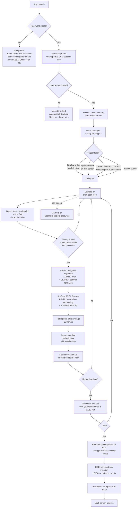

<<<<<<< HEAD
<div align="center">
<br><br>
 
<h1>macOS FaceUnlock</h1>
 
<p><strong>Unlock your Mac with your face.</strong><br>
Free, open-source face-recognition unlock daemon for macOS. No additional hardware, no cloud, no subscription.</p>
 
 


  
</div>

---

## Table of Contents

- [What it does](#what-it-does)
- [Requirements](#requirements)
- [Demo](#demo)
- [Install](#install)
- [Setup](#setup)
- [Daily use](#daily-use)
- [Security model](#security-model)
- [Tech stack](#tech-stack)
- [Migration from earlier versions](#migration-from-earlier-versions)
- [Acknowledgments](#acknowledgments)
- [License](#license)
=======
# FaceUnlock

A face-recognition unlock daemon for macOS. When you lock your Mac, FaceUnlock recognizes you through the camera and types your password into the lock screen for you. No additional hardware required — the FaceTime camera and Apple Neural Engine do the work.

**Everything is processed locally.** Nothing leaves your Mac. The full stack — camera capture, face detection, ML inference, encryption — runs on-device.

> ⚠️ Personal-use security tool. Read the **Security model** section before relying on it.
>>>>>>> 0daa1e5 (Initial commit)

---

## What it does

<<<<<<< HEAD
- Enrolls your face from 7 poses using **ArcFace** (InsightFace ResNet50, converted to Core ML, running on the Apple Neural Engine).
- On the lock screen, pressing Space/Return (or waking the display) triggers a scan that verifies identity + liveness, then types your Mac password for you.
- Runs as a menu bar agent.
- Your Mac password and face embeddings are AES-GCM encrypted with a session key stored in the Keychain and gated by Touch ID. One Touch ID unlock is needed per reboot to arm auto-unlock.

## Requirements

- macOS 14 (Sonoma) or later
- Apple Silicon strongly recommended (Intel works, but slower)
- A default camera (built-in, external, or Continuity Camera)
- Touch ID or a device password

## Demo

Full install + setup walkthrough on YouTube:

[](https://youtu.be/TZHXuBUaZ_8)

## Install

### Via Homebrew

1. Add the tap:
   ```
   brew tap sh4dow-clone/tap
   ```
2. Install the cask:
   ```
   brew install --cask sh4dow-clone/tap/faceunlock
   ```

> 💡 **If macOS blocks the app on first launch remove the quarantine attribute:**
>
> ```
> xattr -dr com.apple.quarantine /Applications/FaceUnlock.app
> ```


### Direct download

Alternatively, download the app directly from the [Releases](../../releases) page.

## Setup

> Prefer video? The [demo above](#demo) walks through install and setup end-to-end.

1. Open **FaceUnlock.app** and allow **camera** access when prompted.
2. Grant **Accessibility** permission (Settings tab → "Request Permission…") - needed to type into the lock screen.
3. **Set Mac password**: Settings tab → "Set Password…", enter your login password twice.
4. **Enroll your face**: Face Recognition tab → "Capture" (requires Touch ID) and follow the 7-pose guide.
5. Turn on **"Auto-unlock when display wakes (while screen is locked)"**.

Use **"Add Captures"** later to enroll more embeddings under different lighting (up to 35 total, oldest evicted first) - this improves accuracy and lets you safely raise the match threshold.

### Optional settings

| Setting | Description |
|---|---|
| **Icon Placement** | Show/hide Dock and Menu Bar icons independently. |
| **Launch at Login** | Add FaceUnlock via System Settings → General → Login Items. |
| **Auto-scan when face is centered** | Triggers a scan automatically without a keypress. Off by default. |
| **Match threshold** | Default 0.70. Recommended after a few enrollment sessions: 0.75 (balanced), 0.80 (secure), 0.85 (high-security). |
| **Auto-unlock delay** | Default 4s between trigger and camera activation, so you can abort with `⌃⌘Q`. |

## Daily use

1. Lock your Mac.
2. Wake the display and press **Space** or **Return** on the lock screen.
3. Camera runs for up to 15s, checks face + liveness, and types your password in.
4. If it can't recognize you in time, the camera turns off and you type your password manually - same fallback as Face ID / Windows Hello.

Working distance: roughly 20–70cm from the camera.

## Security model

| Data | Storage | Encryption |
|---|---|---|
| Mac password | Keychain | AES-GCM + Keychain |
| Session key | Keychain | AES-GCM + Touch ID (enforced by app via LocalAuthentication) |
| Face embeddings | `~/Library/Application Support/FaceUnlock/embeddings.enc` | AES-GCM, same session key |
| Settings | UserDefaults | Plaintext (not sensitive) |

The session key is the single unwrap point - without Touch ID, the password blob and embeddings file are both meaningless ciphertext.

**Built-in protections:**

- ArcFace face matching with proper alignment/normalization and cosine similarity against your enrolled set.
- Multi-frame averaging and a pose filter to reduce noise.
- Passive movement-based liveness check (defeats static photos).
- Only faces in a centered ROI are considered.
- Password exists as plaintext only briefly, zeroed immediately after use.
- Hardened Runtime, anti-debugger protection, minimal entitlements (camera - no network, no other permissions).
- Fully local processing - no telemetry, no third-party SDKs.

**Things to keep in mind:**

- After Touch ID authorizes access, FaceUnlock briefly accesses your password only to complete the unlock. The app uses Hardened Runtime and minimal system permissions to help protect this process, while macOS security continues to provide the primary layer of protection.
- FaceUnlock uses movement-based liveness detection to distinguish a real person from a static photo. While it doesn't use dedicated depth hardware, it provides reliable verification for everyday use.
- If you have a very close lookalike (such as an identical twin), increasing the match threshold can provide additional confidence.

**Bottom line:** FaceUnlock adds a fast, convenient unlock experience while keeping your existing macOS password as the foundation of your security. Review the security model to choose the settings that best match your preferences.

## Tech stack

SwiftUI · AVFoundation · Vision · Core ML (ArcFace on ANE) · CryptoKit (AES-GCM) · LocalAuthentication · Keychain Services · CGEvent keystroke injection

## Migration from earlier versions

Older builds stored embeddings as plaintext JSON. This is auto-migrated to encrypted storage on your next enrollment - your existing enrollment keeps working in the meantime. To migrate immediately: Face Recognition tab → Reset → Capture.

## Acknowledgments

- **InsightFace** for the [w600k_r50](https://github.com/deepinsight/insightface/tree/master/model_zoo)
=======
- Enrolls your face from 7 poses (straight, turn left/right, roll left/right, closer, farther) using **ArcFace** — the InsightFace ResNet50 model (buffalo_l / w600k_r50) converted to Core ML and executed on the Apple Neural Engine.
- Enrollment captures each pose over a **2-second stability window** (multi-frame average → single high-quality embedding). Additive: you can run **"Add Captures"** later under different lighting to enlarge the enrolled set (up to 35 embeddings, oldest evicted FIFO).
- On lock screen, when you press Space / Return or the display wakes from sleep, it silently scans your face, verifies identity + liveness, and types your Mac password into the password field.
- Runs as a menu bar agent. Dock icon is optional and toggled at runtime.
- Both the **Mac password** and the **enrolled face embeddings** are encrypted with AES-GCM using a session key that itself lives in the Keychain protected by Touch ID. First app launch after each reboot requires one Touch ID to unwrap the session key — same model as Face ID and Windows Hello.

## Requirements

- macOS **14 (Sonoma)** or later
- Apple Silicon strongly recommended (ANE inference is fastest there). Intel Macs work but slower.
- A camera the OS considers the default (built-in FaceTime, external webcam if that's the only camera, or Continuity Camera on macOS 13+).
- Touch ID **or** a device password.

## Install

### Via Homebrew (recommended)

```
brew install --cask sh4dow-clone/tap/faceunlock
```

The cask's `postflight` hook removes Gatekeeper's quarantine attribute automatically. After install, launch from Applications or Spotlight.

### Via direct download

Download `FaceUnlock.zip` from the latest [GitHub Release](https://github.com/HasBrain/FaceUnlock/releases/latest), unzip, drag `FaceUnlock.app` into `/Applications`, then run once:

```
xattr -dr com.apple.quarantine /Applications/FaceUnlock.app
```

### Why the extra command?

FaceUnlock is currently distributed **ad-hoc signed** — there is no paid Apple Developer ID behind it, so no notarization ticket is stapled to the app. macOS Gatekeeper refuses to launch un-notarized downloads by default, and `xattr -dr com.apple.quarantine` tells Gatekeeper the user explicitly authorized this app.

**Do not run `codesign --sign -` on the installed app.** That command strips the entitlements the app relies on (camera access, in particular) and breaks it. If a paid Developer ID + notarization is ever added, this whole step disappears — install becomes a normal drag-and-drop with no terminal commands.

## End-to-end flow



## Setup

### One-time

1. Open FaceUnlock.app.
2. **Camera permission** → allow when prompted.
3. **Accessibility permission**: Settings tab → "Request Permission…" → toggle FaceUnlock on in System Settings → Privacy & Security → Accessibility. Required to inject keystrokes into the lock screen.
4. **Set Mac password**: Settings tab → "Set Password…" → enter your macOS login password twice. Generates a fresh AES-GCM 256-bit session key (or reuses the one from a prior enrollment), encrypts the password with it.
5. **Enroll your face**: Face Recognition tab → "Capture" (requires Touch ID). Follow the 7-pose guide — each pose is captured over a **~2-second stability window** where multiple frames are averaged into a single high-quality embedding (√N noise reduction over a single-shot). The resulting embeddings are encrypted with the same session key before being written to disk.
6. Turn on **"Auto-unlock when display wakes (while screen is locked)"** in Settings tab.

### Improving accuracy over time

Once you're enrolled, use **"Add Captures"** (the same button, relabeled once an enrollment exists) whenever you're in noticeably different lighting — morning window light vs afternoon overhead vs evening lamp, or with/without glasses. Each Add Captures session enrolls 7 more stable embeddings alongside the existing ones. This is the model that Face ID and Windows Hello use internally, and it's the reliable way to reach high thresholds (0.85+) across the full range of lighting you encounter daily.

- Sessions 1–5: pure accumulation, growing 7 → 14 → 21 → 28 → 35.
- Session 6+: at cap. Each new session evicts the oldest 7 embeddings (FIFO), so the enrolled set naturally tracks your current appearance / lighting over time.

### Optional

- **Icon Placement** (menu bar → Icon Placement): toggle Dock and/or Menu Bar visibility independently.
- **Launch at Login**: use macOS's built-in **System Settings → General → Login Items → Open at Login** to add FaceUnlock so it starts with your Mac.
- **Auto-scan when face is centered**: polls the camera and triggers automatically when your face is well-positioned in the circle. Off by default.
- **Match threshold**: default 0.70. Personal-use recommendations after enrollment: **0.75** balanced, **0.80** secure daily driver, **0.85** high-security (needs 2-3 Add Captures sessions across different lighting to be reliable). 0.90+ is not realistically achievable with a 2D camera. Persisted across launches.
- **Auto-unlock delay**: default 4s between trigger and camera turning on. Gives you time to abort with `⌃⌘Q` → password if you decide against face unlock.

## Daily use

1. Lock your Mac (`⌃⌘Q` or close the lid).
2. When you come back, wake the display and press **Space** or **Return** on the lock screen.
3. Camera turns on for ≤ 15s. Face + liveness check runs. Password auto-injected. Mac unlocks.
4. If the scan times out (couldn't recognize you within 15s) the camera turns off and you fall back to typing your password manually. Same behavior as Windows Hello and Face ID.

Working distance: recognizes faces from **~20cm out to ~70cm** from the camera. Sitting at a normal desk position works.

## Security model

### Everything sensitive is encrypted at rest

| Data | Storage | Encryption |
|---|---|---|
| **Mac password (ciphertext blob)** | Keychain (`encryptedPasswordBlob`) | AES-GCM (our layer) + macOS Keychain |
| **Session key (256-bit AES)** | Keychain (`sessionKey`, `kSecAttrAccessibleWhenUnlockedThisDeviceOnly`) | Touch ID is enforced by the app via `LAContext.evaluatePolicy(.deviceOwnerAuthenticationWithBiometrics)` before the Keychain item is read. One prompt per app launch. |
| **Face embeddings (ciphertext blob)** | `~/Library/Application Support/FaceUnlock/embeddings.enc` | AES-GCM with the same session key |
| User settings (thresholds, toggles) | UserDefaults | plaintext — not sensitive |
| ArcFace model | App bundle | plaintext — public model |

The session key is the single unwrap point. Without Touch ID, nothing decrypts:
- Session key ciphertext in the Keychain is meaningless.
- Encrypted password blob is meaningless.
- Encrypted embeddings file is meaningless.

### What's guaranteed

- ✅ **Face match**: ArcFace ResNet50 (buffalo_l / w600k_r50), 512-d L2-normalized embeddings. Preprocessing matches InsightFace training-time exactly — **5-point Umeyama landmark alignment** (eyes + nose tip + mouth corners), 112×112 RGB crop normalized to [-1, 1], CLAHE + gamma exposure normalization for variable lighting, TTA horizontal flip. Verification requires cosine similarity against your enrolled centroid AND max-individual to clear the threshold.
- ✅ **Multi-frame stability**: live scan runs a rolling **best-of-N average** (15 frames) with a pose filter (±20° yaw/roll) — averages out motion blur, exposure jitter, and alignment micro-errors before comparing to the enrolled set.
- ✅ **Cold-camera handling**: verify waits for the camera to converge auto-exposure / auto-white-balance before scanning begins, then discards the first 800 ms of scan frames — prevents systematically over/underexposed frames from producing shifted embeddings after long display sleep.
- ✅ **Enrollment quality**: each pose is captured over a 2-second stability window and multiple valid frames averaged into a single stored embedding.
- ✅ **Liveness**: passive movement detection — natural yaw/roll variance of ≥ 0.013 rad over ~0.4s of data. A flat photograph or a screenshot can't accumulate the variance.
- ✅ **ROI filtering**: only faces whose center falls inside the centered 50% × 60% ROI are considered — background people are ignored.
- ✅ **AES-GCM encryption** of both password and enrollment data using a session key held only in memory after unwrap.
- ✅ **Data-based password handling**: password flows through as `Data`, plaintext lifetime bounded by `.resetBytes(in:)` immediately after keystroke injection.
- ✅ **Touch ID gate** on enrollment, reset, and password clear.
- ✅ **Global keystroke monitor** only listens for `Space` / `Return` / `Numpad Enter`, and only while the screen is locked. Torn down on unlock.
- ✅ **Anti-debugger**: `PT_DENY_ATTACH` (ptrace flag 31) is invoked in release builds. Blocks casual `lldb -p <pid>` attempts.
- ✅ **Minimal entitlements**: the release binary carries only `com.apple.security.device.camera` and `com.apple.security.files.user-selected.read-only`. No network, no AppleEvents, no Contacts / Calendar / Photos, no keychain-access-groups (uses the default per-app group).
- ✅ **All processing local**. No third-party SDKs, no network I/O, no telemetry.

### What's NOT guaranteed

- ⚠️ **In-process compromise reads plaintext once session is unlocked.** Once Touch ID has unwrapped the session key, any code running as our bundle can call `PasswordVault.readPassword()` or `decryptWithSessionKey(...)` to recover plaintext. If a real exploit gives an attacker in-process code execution, encryption at rest doesn't help while the session is active.
- ⚠️ **Touch ID is app-enforced, not OS-enforced.** Because the app is ad-hoc signed, we can't use the Secure-Enclave-backed `SecAccessControl(.userPresence)` gate on the Keychain item (that requires a paid Developer certificate). Instead, the app calls `LAContext.evaluatePolicy` itself before reading the item. Same UX (Touch ID prompt appears at launch); functionally the enforcement point moves from the OS layer to the app layer. An attacker with debugger-level access to the running process could theoretically skip the check. Restored to OS-enforced once a paid Developer ID is obtained.
- ⚠️ **Hardened Runtime and Sandbox are currently disabled.** Both require a paid Developer certificate to work correctly alongside ad-hoc signing; they've been turned off in this build to keep the app launchable via Homebrew / direct download. Effect: dylib injection is not blocked, and the process isn't sandboxed. Will be re-enabled together with Developer ID + notarization.
- ⚠️ **Liveness is 2D movement-based, not depth-based.** A well-composed looping video of you on a phone screen could in principle sway enough to pass. A printed photo cannot.
- ⚠️ **Identical-twin / close-lookalike risk.** ArcFace is very discriminative but not perfect. If someone who looks a lot like you stands in front of the camera, they might match. Tune the threshold upward to reduce this.
- ⚠️ **Password is briefly present as a Swift `String` during keystroke injection.** `String` doesn't zero on release. We minimize this to a few milliseconds inside `KeystrokeInjector.typeAndReturn`, but it's a real window.

### Bottom line

FaceUnlock is a **convenience layer over your macOS login password**. The password remains the real secret. If you don't trust the threat model above, don't enable auto-unlock.

## Tech stack

- **SwiftUI + `@Observable`** (macOS 14+)
- **AVFoundation** — camera capture
- **Vision** — face detection + `VNDetectFaceLandmarksRequest` for 5-point alignment
- **Core ML** — ArcFace inference on the Apple Neural Engine
- **Core Image / CGAffineTransform** — Umeyama least-squares 5-point similarity transform, CLAHE + gamma preprocessing
- **CryptoKit** — AES-GCM 256-bit encryption of stored password AND enrolled embeddings
- **LocalAuthentication** — Touch ID gating (enrollment, session unwrap, reset)
- **Keychain Services** — session key + encrypted password blob (both `kSecAttrAccessibleWhenUnlockedThisDeviceOnly`; Touch ID is app-enforced via LAContext, see Security model)
- **CGEvent** — Unicode keystroke injection to the lock screen field
- **NSEvent.addGlobalMonitorForEvents** — Space / Return monitor while locked
- **DistributedNotificationCenter** — screen lock / unlock notifications
- **NSWorkspace** — display sleep / wake notifications

## Architecture

```
FaceUnlockApp                    @main App scene
 ├─ AppDelegate                  Keep alive when last window closes
 └─ @State AppController         (long-lived, @Observable, @MainActor)
     ├─ CameraManager            AVCaptureSession lifecycle
     ├─ FaceEnrollmentService    Vision + Core ML pipeline
     │                           Encrypted embedding persistence
     │   └─ FaceEmbedder         Core ML wrapper (ArcFace preferred)
     ├─ LockMonitor              Distributed + Workspace notifications
     │                           (lock / unlock / sleep / wake)
     ├─ PasswordVault            AES-GCM session key + Keychain wrapper
     │                           encrypt/decrypt API used by both
     │                           password and embedding storage
     ├─ KeystrokeInjector        CGEvent Unicode + Return
     └─ Triggers                 Wake, user-input, framing, manual
ContentView                      Settings window (3 tabs)
MenuBarContent                   Status bar dropdown
```

## Signing & distribution

FaceUnlock is currently ad-hoc signed (identity `-`). Three consequences worth understanding:

1. **First-launch friction**: Gatekeeper refuses to launch un-notarized downloads by default. Homebrew's cask postflight runs `xattr -dr com.apple.quarantine` for you; direct-download users run it once themselves.
2. **Session-key gate is app-layer**: `SecAccessControl(.userPresence)` requires a paid Developer certificate to work with ad-hoc signing (macOS AMFI blocks the app otherwise, "The application FaceUnlock can't be opened."). The gate is enforced at the app layer via `LAContext.evaluatePolicy` instead. See the "What's NOT guaranteed" bullet for the tradeoff.
3. **Sandbox & Hardened Runtime are off**: same root reason — both require a real Developer certificate. Both remain in the codebase, configurable via the Xcode project; they'll flip back on once the paid Developer path is available.

### Upgrade path (when a paid Developer ID + $99/year subscription is obtained)

- Flip `DEVELOPMENT_TEAM` / `CODE_SIGN_IDENTITY` / `CODE_SIGN_STYLE` back to Apple Development + Automatic
- Turn `ENABLE_APP_SANDBOX` and `ENABLE_HARDENED_RUNTIME` back to YES
- Restore `keychain-access-groups` in the entitlements plist
- Restore `SecAccessControl(.userPresence)` in `PasswordVault.saveSessionKey` (drop the LAContext-based enforcement in `unlockSession`)
- Notarize via `xcrun notarytool` — users can then install with zero terminal commands

## Migration from earlier versions

If you had an enrollment from an older FaceUnlock build (which stored embeddings as plaintext JSON at `embeddings.json`), it will be **auto-migrated on next enrollment**. The old file will be deleted and replaced with the encrypted `embeddings.enc` version. In the meantime, the app can still read the plaintext file — your existing enrollment keeps working across the upgrade.

If you'd prefer to migrate immediately: Face Recognition tab → Reset → Capture. Fresh enrollment, immediately encrypted.

## Acknowledgments

- **InsightFace** for the [w600k_r50](https://github.com/deepinsight/insightface/tree/master/model_zoo) ArcFace model. Alignment preprocessing follows the InsightFace 5-point canonical template documented in their [evaluation guide](https://insightface.ai).
- **FaceGate-Mac** by [@dweep-desai](https://github.com/dweep-desai/FaceGate-Mac) — this project's initial ML pipeline structure (Vision face detection → padded crop → 112×112 → Core ML embedding → centroid cosine similarity) was modeled after theirs; the pipeline has since evolved to include 5-point Umeyama alignment, CLAHE + gamma normalization, best-of-N frame averaging, and additive multi-session enrollment.
>>>>>>> 0daa1e5 (Initial commit)

## License

Personal-use. If you redistribute, verify InsightFace's model license terms apply to your use case.
<<<<<<< HEAD

## Support

If it's saved you some time, consider supporting - I'm a student maintaining this in my spare time.

Right now I'm trying to raise **$99 for an Apple Developer Program membership**. That's what it costs to get the app properly signed and notarized - which would eliminate the security warning on install entirely. No more scary popups, no more running `xattr` in the terminal just to open the app.

If you've hit that warning yourself, that's exactly what your support would fix for everyone after you.

[](https://ko-fi.com/sh4dow_clone)

A ⭐ star also helps - it makes the project easier to find for other macOS users who need this.
=======
>>>>>>> 0daa1e5 (Initial commit)
